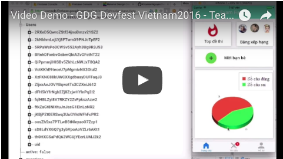
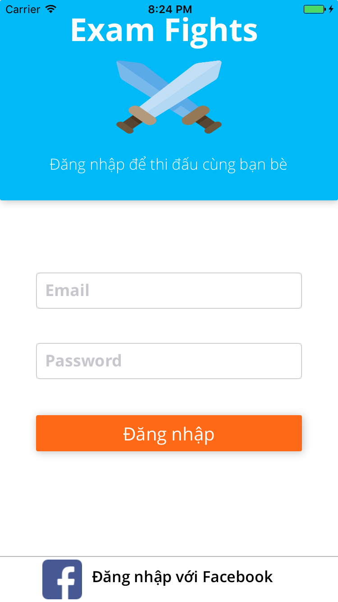
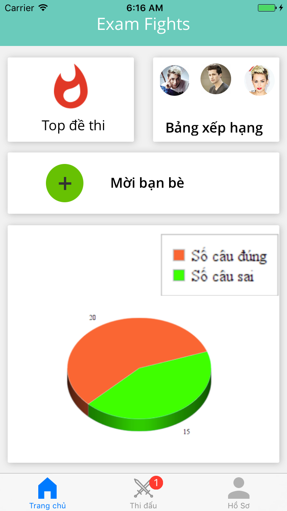
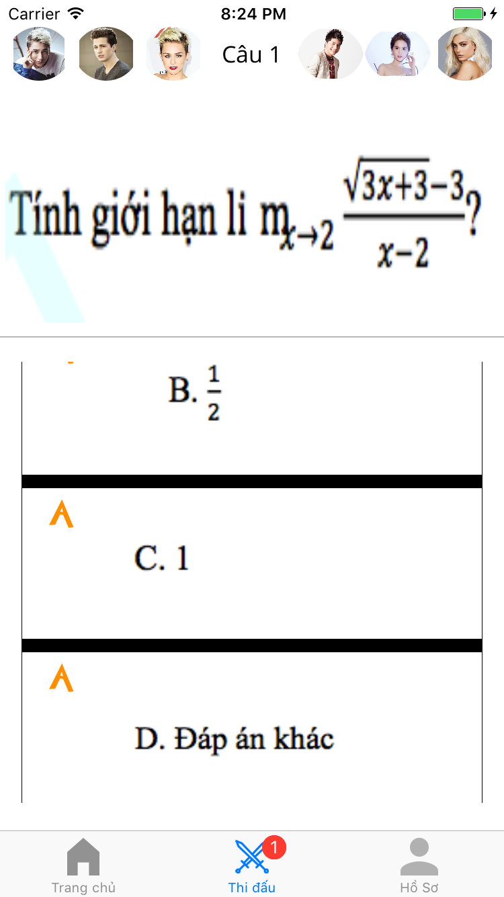
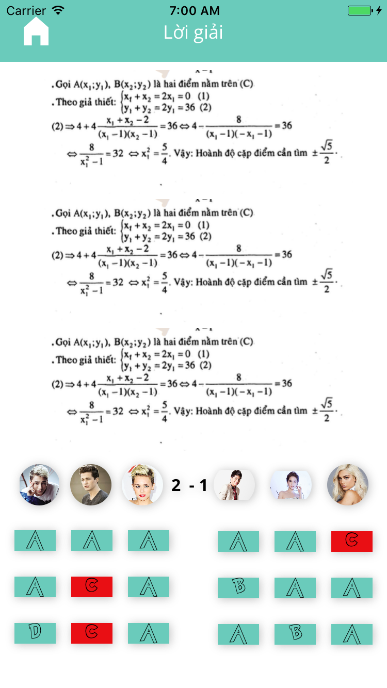

# Exam-Fights

Exam Fights là phần mềm cho phép người sử dụng có thể thi đấu với nhau bằng câu các câu hỏi về những kiến thức khác nhau (Luyện thi đại học, luyện thi chứng chỉ tiếng Anh TOEIC, IELTS, TOEFL ).

Các tính năng chính:
- Làm bài trắc nghiệm thi đấu trực tuyến
- Thách đấu theo đội nhóm
- Xem được lời giải chi tiết sau mỗi lần thi đấu 
- Bảng xếp hạng người dùng có thành tích cao
- Phân tích các câu người dùng đã làm để gợi ý các phần người dùng còn yếu. Đề nghị họ làm lại các câu hỏi trong phần đó. 
Ví dụ người dùng giải 100 câu trong môn Toán và sai 5 câu trong phần tích phân thì sau khoảng 2 tuần thì app sẽ gửi 
thông báo để user làm lại những câu này.

Login Screen:

Home Screen:

Fight Screen:

Result Screen:

