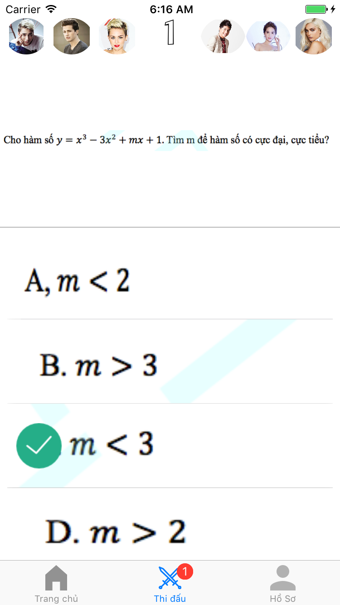

# Exam-Fights

Exam Fights là phần mềm cho phép người sử dụng có thể thi đấu với nhau bằng câu các câu hỏi về những kiến thức khác nhau. Phiên bản hiện tại nhắm đến đối tượng là các học sinh trung học phổ thông.

Các tính năng chính:
- Làm bài trắc nghiệm thi đấu trực tuyến
- Thách đấu theo đội nhóm
- xem được lời giải chi tiết sau mỗi lần thi đấu
- Bảng xếp hạng người dùng có thành tích cao

Login Screen:

Home Screen:

Fight Screen:

Result Screen:

